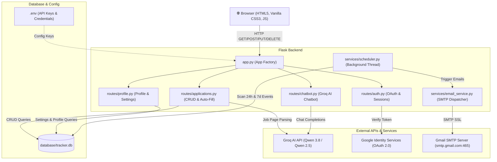

# 💼 Job & Internship Application Tracker

> A full-stack, enterprise-grade application tracker featuring **Groq AI Job Auto-Fill**, **Floating AI Career Assistant Chatbot**, **Smart Calendar**, **Analytics & Performance Insights**, **24-Hour Automated Event Email Reminders**, **7-Day Follow-Up Alerts**, **Google One Tap OAuth 2.0**, and multi-tabbed **Profile & Settings management**. Built with **Python Flask**, **SQLite**, **Groq AI (Qwen 2.5/3.8)**, and vanilla **HTML5/CSS3/JavaScript**.

---

## 📌 1. Executive Summary & Problem Statement

### 🔴 The Problem
Job seekers and students applying for tech roles and internships face major bottlenecks:
- **Scattered Data**: Applications across spreadsheets, email threads, and browser tabs lead to lost follow-ups.
- **Missed Interviews & Assessments**: Candidates miss scheduled online assessments and interview rounds due to a lack of automated 24-hour advance warnings.
- **Manual Data Entry Exhaustion**: Manually typing company name, job title, location, and salary for dozens of job links is tedious.
- **Lack of Interview Preparation Support**: Candidates lack instant AI-driven guidance tailored to their target company and job role.

### 🟢 The Solution
**Job & Internship Application Tracker** solves this by delivering a unified visual platform:
1. **AI-Powered URL Auto-Fill**: Extract Company Name, Job Title, Location, Job Type, and Salary from any job posting URL in under 2 seconds using **Groq AI (Qwen 3.8)**.
2. **AI Career Assistant Chatbot**: Integrated floating AI chatbot for instant Interview Prep, Resume Advice, and Follow-Up Email drafting.
3. **24-Hour & 7-Day Automated Email Reminders**: Background daemon scheduler dispatches Gmail SMTP email alerts **24 hours before scheduled Interviews & Assessments** and **7 days after untouched applications**.
4. **Smart Calendar & Full-Page Views**: Interactive full-page views for Dashboard, Analytics, Calendar, Profile Information, and System Settings.

---

## 🚀 2. Comprehensive Feature Breakdown

### 🤖 1. Groq AI Auto-Fill & AI Career Assistant
- **URL Auto-Fill**: Parses postings from LinkedIn, Greenhouse, Lever, Workday, Salesforce, and direct career sites. Uses **Groq AI (`qwen/qwen3.8-27b`)** with zero-shot HTML/JSON extraction.
- **Floating AI Career Assistant Chatbot**:
  - Chat drawer widget available across the application.
  - Pre-built quick prompt pills for *Interview Prep*, *Application Summary*, and *Follow-up Email Drafting*.
  - Powered by Groq AI API with automatic Markdown formatting.

### 📅 2. Smart Calendar View (`/view-calendar`)
- **Interactive Monthly Grid**: Displays scheduled Interviews, Assessments, and Follow-Up dates.
- **Color-Coded Event Pills**: Distinct badges for Interviews (Purple), Follow-ups (Amber), Assessments (Blue), and Deadlines (Red).
- **Interactive Pulsing**: Clicking any calendar event pill automatically navigates to the Dashboard and applies a smooth pulse-glow animation to the target application card.

### 📈 3. Analytics & Performance Insights (`/view-analytics`)
- **Key Performance Indicators (KPIs)**: Total Applications, Interview Rate (%), Offer Rate (%), and Rejection Rate (%).
- **Status Funnel Breakdown**: Dynamic horizontal progress bars tracking candidate conversion rates.
- **Status Proportion Donut Ring**: SVG Donut Chart dynamically showing percentage distribution.

### ⏰ 4. Automated 24-Hour & 7-Day Email Reminders
- **24-Hour Event Reminders**: Background daemon thread checks scheduled `interview_date` and `assessment_date` fields. Sends automated email notifications **24 hours before the event** to the user's inbox.
- **7-Day Stale Alerts**: Identifies applications untouched for 7+ days and triggers follow-up email reminders.
- **Anti-Spam Safeguards**: Database tracks `last_interview_reminder_sent`, `last_assessment_reminder_sent`, and `last_email_sent` to guarantee users receive **at most one email per event**.

### 👤 5. Profile Information Management (`/view-profile`)
- **Live Avatar Preview**: Supports profile photo URLs or initial monograms.
- **Personal Details**: Full Name, Email Address (Read-only), Phone Number, Location / City.
- **Academic & Professional Background**: Professional Title (e.g. *Computer Science Student | Python & AI/ML*), College / University, and Graduation Year.

### ⚙️ 6. System Settings & Preferences (`/view-settings`)
- **Notifications Tab**: Toggle switches for Follow-up Reminders, Interview Reminders, Reminder Time selector (*1 Day Before*, *2 Hours Before*, *Morning of*), and Email Notifications.
- **Appearance Tab**: Theme selector (*Light*, *Dark*, *Auto System*), Dashboard View (*Kanban*, *List*), Application Card Density (*Compact*, *Comfortable*, *Spacious*), and Display Toggles.
- **Account & Security Tab**: Change Password form, Active Sessions display with "Active Now" status, Logout All Devices, and Account Deletion danger zone.

### 🎨 7. Split Layout Auth & Public Landing Page (`/welcome`)
- **Public Landing Page**: Unique marketing page highlighting AI features, calendar, and analytics.
- **Executive Auth Pages**: Split-screen design for Login (`/login`) and Sign-Up (`/signup`) with zero shadow boxes as per modern UI standards.

---

## 🏗️ 3. Architecture & Data Flow



---

## 🗄️ 4. Database Schema

```mermaid
erDiagram
    USERS ||--o{ APPLICATIONS : owns
    USERS ||--o| USER_SETTINGS : configures
    
    USERS {
        int id PK
        string username UK
        string email UK
        string password_hash
        string google_id UK
        string avatar_url
        string full_name
        string phone
        string location
        string headline
        string university
        string grad_year
        timestamp created_at
    }

    USER_SETTINGS {
        int user_id PK_FK
        int notify_followup
        int notify_interview
        string reminder_time
        int email_notifications
        string theme
        string dashboard_view
        string card_density
        int show_stats
        int show_warnings
        int show_interview_dates
    }

    APPLICATIONS {
        int id PK
        int user_id FK
        string company_name
        string job_title
        string status
        date date_applied
        date last_updated
        text notes
        date last_email_sent
        date interview_date
        date deadline_date
        date assessment_date
        date followup_date
        string job_url
        string salary
        string location
        string job_type
        date last_interview_reminder_sent
        date last_assessment_reminder_sent
    }
```

---

## 🔌 5. API Reference

| Method | Endpoint | Description | Auth Required |
|--------|----------|-------------|---------------|
| `GET` | `/welcome` | Renders public landing page | No |
| `GET` | `/` | Renders main application view | Yes |
| `POST` | `/signup` / `/login` | User registration and authentication | No |
| `POST` | `/auth/google` | Google One Tap OAuth 2.0 authentication | No |
| `GET` | `/applications` | Fetches user job applications | Yes |
| `POST` | `/applications` | Creates new job application entry | Yes |
| `PUT` | `/applications/<id>` | Updates application fields or status | Yes |
| `DELETE` | `/applications/<id>` | Deletes job application entry | Yes |
| `POST` | `/api/autofill-url` | Extracts job details from URL via Groq AI | Yes |
| `POST` | `/api/chatbot/chat` | Groq AI Career Assistant chatbot completions | Yes |
| `GET` | `/api/calendar-events` | Fetches structured calendar events | Yes |
| `GET` | `/api/analytics` | Returns funnel metrics and KPI calculations | Yes |
| `GET` / `PUT` | `/api/profile` | Retrieves / updates user profile information | Yes |
| `GET` / `PUT` | `/api/settings` | Retrieves / updates system preferences | Yes |
| `POST` | `/api/account/change-password` | Updates account password | Yes |
| `POST` | `/api/account/delete` | Permanently deletes account and data | Yes |

---

## 🛠️ 6. Quick Start & Setup Guide

### 1. Clone & Virtual Environment Setup
```bash
git clone https://github.com/Dhayanandham123/JobApplicationTracker.git
cd JobApplicationTracker

# Create & activate virtual environment
python -m venv venv
venv\Scripts\activate      # Windows

# Install dependencies
pip install -r requirements.txt
```

### 2. Configure Credentials (`.env`)
Create a `.env` file in the project root:
```env
SECRET_KEY=dev-secret-key-job-tracker
DEBUG=True
GOOGLE_CLIENT_ID=your_google_client_id.apps.googleusercontent.com
MAIL_SERVER=smtp.gmail.com
MAIL_PORT=465
MAIL_USERNAME=your_gmail@gmail.com
MAIL_PASSWORD=your_16_character_app_password
GROQ_API_KEY=gsk_your_groq_api_key
GROQ_MODEL=qwen/qwen3.8-27b
```

### 3. Run Application Server
```bash
python app.py
```
Open **`http://127.0.0.1:5000`** in your web browser.

### 4. Run Automated Test Suite
```bash
pytest
```
*Executes all 21 automated unit tests (`tests/test_routes.py`, `tests/test_profile_settings.py`, `tests/test_event_reminders.py`, `tests/test_chatbot.py`).*

---

## 📺 7. Presentation & Demo Checklist

- [x] **Sign-in Options**: Login via Username/Password or Google One Tap.
- [x] **URL Auto-Fill**: Paste LinkedIn/Greenhouse link and click **Auto-Fill**.
- [x] **AI Assistant Chatbot**: Ask for interview tips or resume feedback.
- [x] **24-Hour Email Reminder**: Schedule an Assessment or Interview for tomorrow to test instant email delivery.
- [x] **Smart Calendar**: Click an event pill to highlight the card on the dashboard.
- [x] **Analytics Funnel**: View real-time KPI metrics and conversion charts.
